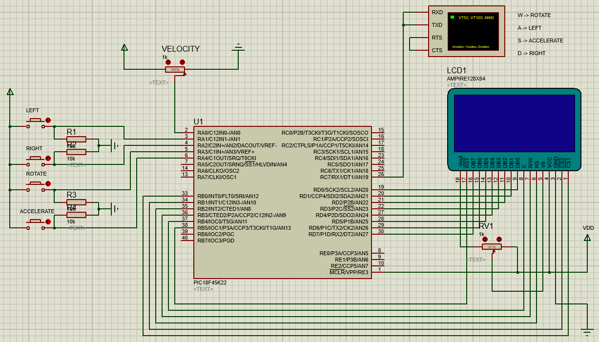
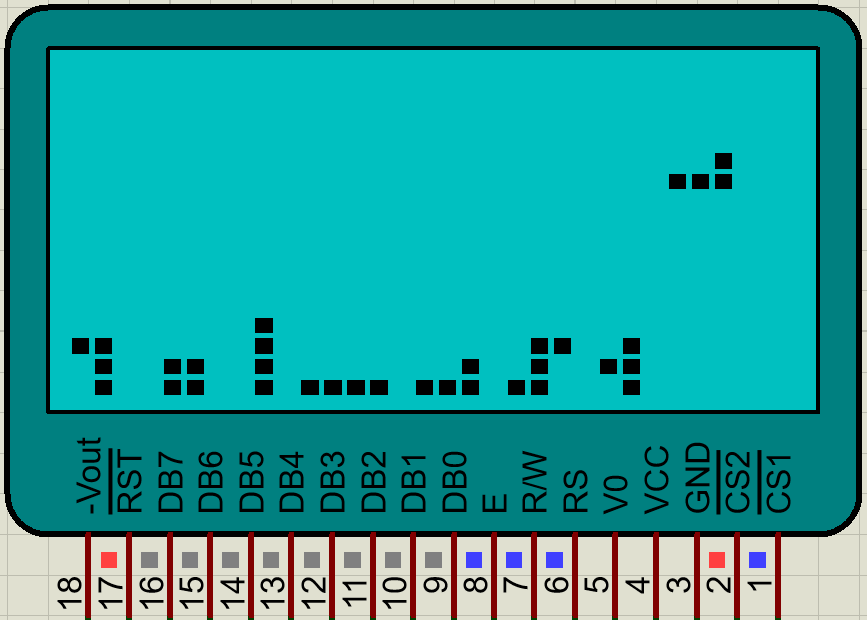

# TETRIS-for-PIC18F45K22
This is the tetris game made to run on a PIC18F45K22 chip. It recieves input via keyboard and/or buttons connected directly to the corresponding pins and a potenciometer and outputs to a GLCD screen.

**How to set up the hardware components:**

**Example of possible output to GLCD screen:**

